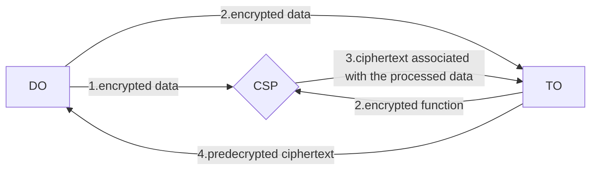

# JDF-HE 细节
Key generation:
$$ {all|1|2|3|all}
\begin{array}{c}
DOGen(1): G\ '(1^\kappa) = (n,q, R_q, \chi_q)\\
取样：s \gets R_q, a \gets R_q, \tilde a \gets R_q, e \gets \chi_q, \tilde e \gets \chi_q \\
私钥sk_d = s, 公钥 pk_d = (pk_ℓ, R_q) = (a,b = as + 2e,R_q) , ek_d = (\tilde a,\tilde  as + 2\tilde e)
\end{array}
$$  
Outsourcing:
$$ {all|1|2}
\begin{array}{c}
DOEnc(pk_d, m): c = (c_0 = -pk_{d_0}, c_1 = pk_{d_1} + m)\\
FOEnc(1^k，f): G(1^\kappa, f) = (\alpha, \beta,R_\beta, \chi_\beta)
\end{array}
$$  

---
transition: slide-up
---
Data Processing:
$$ 
\begin{array}{c}
Eval(c, g, ek_d, ek_f ) \to c^*
\end{array}
$$ 
Function Decryption:
$$ 
\begin{array}{c}
FODec(c, c^*=g(c), sk_f = h ) \to ct,\ ct = \left[\left[h(c) \times g(c)\right]_\alpha \right]_\beta \\
\end{array}
$$ 

---
transition: slide-up
layout: center
---

 

---
transition: slide-up
---
# 正确性和同态性验证

$$
\begin{array}{l}
DOEnc(pk_d, m): c = (c_0', c_1' + m)=(-a, a*s +2*e + m) \\
DOEnc(pk_d, m'): c' = (c_0', c_1' + m')=(-a', a'*s +2*e' + m')\\
\end{array}
$$ 

DO侧加法同态性:
$$
\begin{array}{l}
c_{add} = (c_0 + c_0'; c_1 + c_1') = ( (a + a′), (a + a′)s + 2(e + e′) + (m + m′))\\
DODec(c_{add}; s) = (a + a′)s + (a + a′)s + 2(e + e′) + (m + m′) = m + m′ \ mod\ 2
\end{array}
$$ 

DO侧乘法同态性:
$$
\begin{array}{l}
c_{mult} = (c_0, c_1)*(c_0', c_1') = (c_0, c_1, c_2)\\
=(-a, a*s +2*e + m) * (-a', a'*s' +2*e' + m')\\
=(-a * s + a*s +2*e + m) * (-a's + a'*s' +2*e' + m')\\
=mm' \ mod\ 2
\end{array}
$$ 

---
transition: slide-up
---

DO侧加法与乘法同态性:
 
$c_{mult}$有三项，但$c_{add}$只有两项，为了避免引起歧义，我们强调在解密过程中应该考虑每个密码文本的多项式形式。

$$
\begin{array}{l}
c = (c_0', c_1' + m)=(-a, a*s +2*e + m) \\
c' = (c_0', c_1' + m')=(-a', a'*s +2*e' + m')\\
c'' = (c_0'', c_1'' + m'')=(-a'', a''*s +2*e'' + m'')\\
\end{array}
$$

$$
\begin{array}{l}
DODec(cc' + c'', s) \\
= DODec((c_0c_0', c_0c_1' + c_0'c_1, c_1c_1') + (c_0'', c_1''), s)\\
=aa's + (-2aa's-am'-a'm)*s + (as+2e+m)*(a's+2e'+m')+c_0'' * s + c_1''\ mod\ 2 \\
=aa's + (-2aa's-am'-a'm)*s + aa's+asm'+a'sm+mm'+c_0'' * s + c_1''\ mod\ 2\\
=mm' + (-a'') * s + a'' * s + 2*e'' + m''\ mod\ 2\\
=mm' + m''\ mod\ 2
\end{array}
$$ 

---
transition: slide-up
---
FO侧正确性验证：
$$
\begin{align*}
&\begin{aligned}
    &FODec(c, c^*=g(c), sk_f = h ) = \left[\left[h(c) \times g(c)\right]_\beta \right]_\alpha \\
    &=[[h(c)*\alpha\varphi(c) \times p(c)+ h(c)*\alpha e+h(c)*f(c)]_\beta]_\alpha \\
    &=[[h(c)*\alpha\varphi(c) \times h_\beta \times t(c)+ h(c)*\alpha e+h(c)*f(c)]_\beta]_\alpha \\
% \end{aligned}\\
    &\text{由于$h_\beta$和$h$互为$mod\ \beta$下的逆元，且$\beta$远大于多项式中的系数}\\
% &\begin{aligned}
    &=[\alpha\varphi(c)\times t(c)+ h(c)*\alpha e+h(c)*f(c)]_\alpha \\
    &=[h(c)*f(c)]_\alpha \\
    &\text{因为$h = 1(mod \alpha)$}\\
    &=f(c)
\end{aligned}
\end{align*}
$$

---
transition: slide-up
---
FO侧加法同态性验证：
$$
\begin{array}{c}
    FOEnc(1^k，f) \to (pk_f, sk_f, ek_f, g) \\
    FOEnc(1^k，f') \to (pk_f, sk_f, ek_f, g') \\
    \text{设$\alpha$为$f$和$f'$中最大系数，且$\beta \gt \alpha$,有: }\\
    g = [\alpha \varphi \times p+ \alpha e+f]_\beta\\
    g' = [\alpha \varphi' \times p+ \alpha e'+f']_\beta\\
\end{array}
$$
计算$\left[\left[hg_{add}\right]_\beta \right]_\alpha$
$$
\begin{array}{l}
    g_{add}=g + g′=[\alpha \varphi \times p+ \alpha e+f]_\beta + [\alpha \varphi' \times p+ \alpha e'+f']_\beta \\ 
    = [\alpha \varphi \times p+ \alpha e+f + \alpha \varphi' \times p+ \alpha e'+f']_\beta \\\\
    \text{因为p=$h_\beta$ * t, 且$\beta$大于一切系数, 且$h\ mod\ \alpha = 1$}\\
    \left[\left[hg_{add}\right]_\beta \right]_\alpha \\
    =[h\alpha \varphi \times p+ h\alpha e+hf + h\alpha \varphi' \times p+ h\alpha e'+hf']_\alpha\\
    =[h(f + f')]_\alpha = f + f'
\end{array}
$$

---
transition: slide-up
---
FO侧乘法同态性验证：
$$
\begin{array}{c}
    g = [\alpha \varphi \times p+ \alpha e+f]_\beta\\
    g' = [\alpha \varphi' \times p+ \alpha e'+f']_\beta\\
    g_{mult} = [(\alpha \varphi \times p+ \alpha e+f) * (\alpha \varphi' \times p+ \alpha e'+f')]_\beta
\end{array}
$$
计算$\left[\left[hg_{mult}\right]_\beta \right]_\alpha$
$$
\begin{array}{l}
    =[h\alpha^2 \varphi \varphi' p^2 + h\alpha^2 \varphi pe' + h\alpha \varphi pf' + h\alpha^2 \varphi' pe]_\alpha \\+ [h\alpha^2 ee' + h\alpha ef' + h\alpha \varphi' pf + h\alpha e'f + hff']_\alpha \\
    \overset{h \equiv 1}{=} ff'
\end{array}
$$
 
由于任何函数都可以使用一个次数趋于无穷大的多项式函数逼近,我们可以加密解密任何一个连续函数。

---
transition: slide-left
---
# 安全性分析
$$
\begin{array}{c}
    即证: Pr[JDF-HE^{DO}_{A,\pi}(\kappa) = 1] \le 1/2 + negl(\kappa)\\
\end{array}
$$

证明如下：假设 B 是另一个试图解决 DRLWE 问题的 PPT 对手。考虑一个与 B 交互的挑战者，首先运行$G'(1^\kappa) = (n,q, R_q, \chi_q)$ , 然后抛硬币，如果为$v=1$，挑战者计算 $p_s = (a, as + 2e)$, 否则随机生成$p_s=(r, r')$。将$(n,q, R_q, \chi_q, p_s)$交给B。
B试图区分$p_s$, B会运行一个子进程A。 
1. B给A $pk_d = (pk_s, R_q)$
2. A从$R_q$ 中选择两个多项式$m_0, m_1$并发送给B
3. B抛硬币，从0 1中选一个z，并通过挑战者的公钥计算$c = (c_0 = -pk_{d_0}, c_1 = pk_{d_1} + m_z)$, 把c给A。
4. A猜c是来自于$m_0还是m_1$，并发送给B，如果A猜对了，输出$v'=1$，否则输出0。
5. $Pr[v'=1|v=1] = Pr[JDF-HE^{DO}_{A,\pi}(\kappa) = 1]\ 且\ Pr[v'=1|v=0] = 1/2$ 
6. 由于**DRLWE**可知，$Pr[v'=1|v=1]-Pr[v'=1|v=0] \lt negl(\kappa)$
7. 所以$Pr[JDF-HE^{DO}_{A,\pi}(\kappa) = 1] \le 1/2 + negl(\kappa)$
   
**$Pr[JDF-HE^{FO}_{A,\pi}(\kappa) = 1] \le 1/2 + negl(\kappa)$同理，不过基于DSPR**

